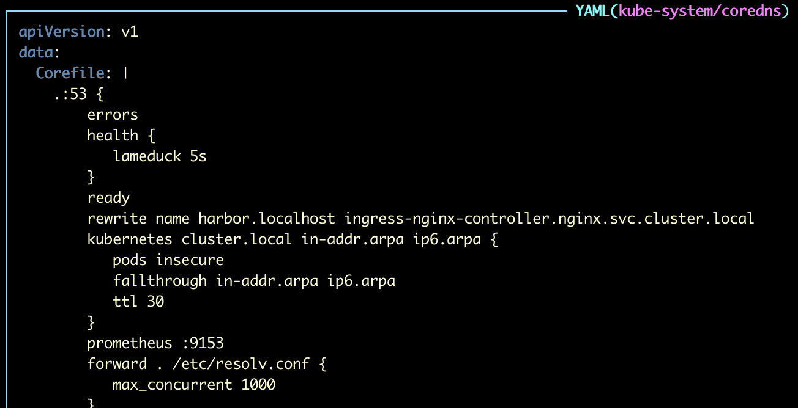

Additionally, a rewrite may need to be added to your clusters DNS server to send Harbor traffic through the nginx controller. Automation is in place to update the CoreDNS configmap to include this rewrite, but in the event of a failed image deployment to Harbor inside the cluster, you may look to add the rewrite show below in the data block. (If your cluster is not using CoreDNS, you can disable this automation by setting the variable `update_coredns`
to false. You will need to find another way to direct traffic to Harbor.)

```
rewrite name harbor.localhost ingress-nginx-controller.nginx.svc.cluster.local
```


