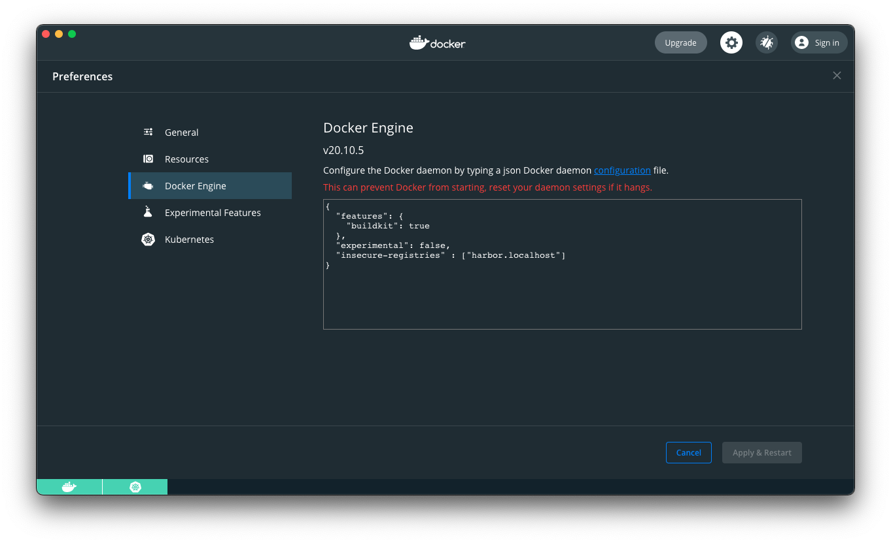

# Rode Demo - Setup

This demo includes a Terraform plan to install Rode, its dependencies and related tools into a Kubernetes cluster to demonstrate basic use cases for Rode and automated governance. It has been tested with Docker for Desktop for Mac with 16gb of memory.

## Prerequisites

- Terraform >= 0.13.0
- Terragrunt
- A Kubernetes cluster (the cluster that comes with Docker Desktop for Mac is recommended)
- kubectl

## Local Cluster

For local access to Jenkins and Harbor through the created ingress, new entries need to be created inside your local hosts file.
```
sudo vi /etc/hosts
```

Copy and paste the lines below to your /etc/hosts file.
```
127.0.0.1 rode-ui.localhost
127.0.0.1 harbor.localhost
127.0.0.1 jenkins.localhost
```

### Harbor

When running locally using an auto-generated certificate for Harbor, you will need to add Harbor as an [insecure Docker registry](https://docs.docker.com/registry/insecure/).



## Install Demo

The Terraform plan modifies the CoreDNS configurations in the cluster to allow Docker images to be pushed to the Harbor container registry from your local environment. If you are not using CoreDNS or experience problems with the Harbor container registry see [Setup DNS](1-Setup-DNS.md) for more information.

To deploy the Rode stack, switch to the `tf` directory, then run

```
terragrunt run-all apply
```

## Looking around

### Rode UI

Goto the [Rode UI](http://rode-ui.localhost)

### Jenkins 

To retrieve the Jenkins admin password for authentication use the command below to copy it to your clipboard.

```
kubectl get secret -n jenkins jenkins -o jsonpath="{.data.jenkins-admin-password}" | base64 --decode | pbcopy
```

Goto the [Jenkins UI](http://jenkins.localhost) and login using the username `admin` and the password you just retrieved.

### Harbor

To retrieve the Harbor admin password for authentication use the command below to copy it to your clipboard.

```
kubectl get secret -n rode-demo-harbor harbor-harbor-core -o jsonpath="{.data.HARBOR_ADMIN_PASSWORD}" | base64 --decode | pbcopy
```

Goto the [Harbor UI](http://harbor.localhost) and login using the username `admin` and the password you just retrieved.

##### next: [Collectors](3-Collectors.md)
