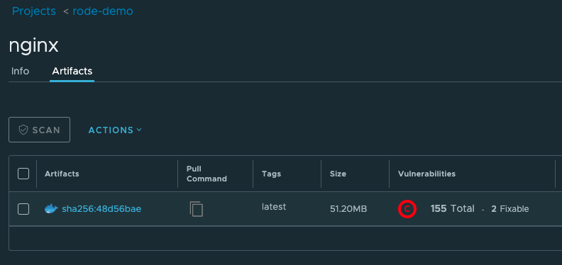
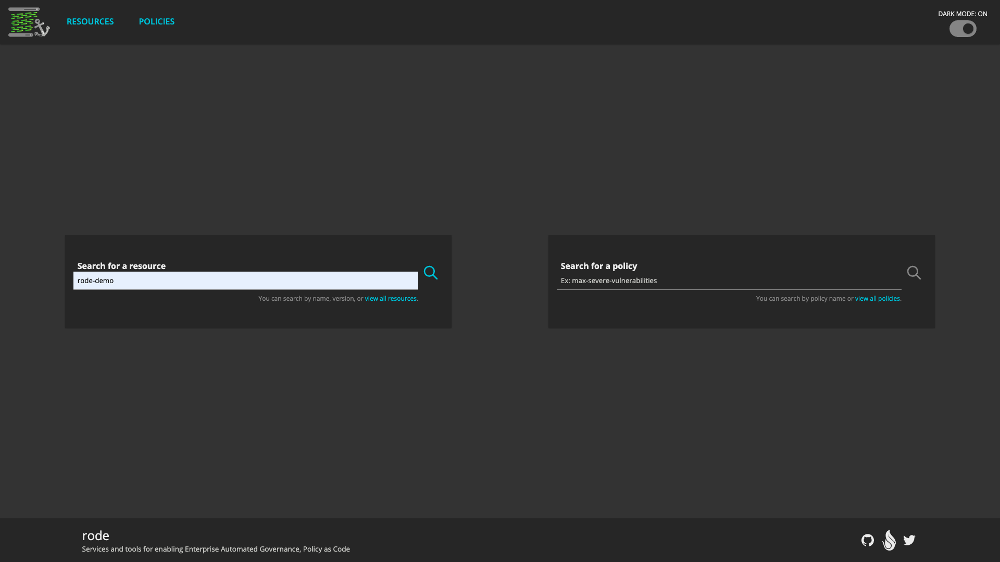
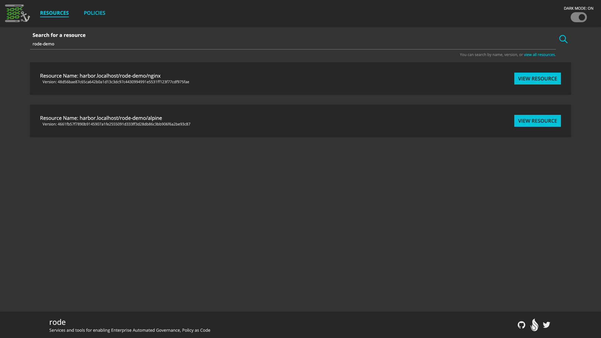
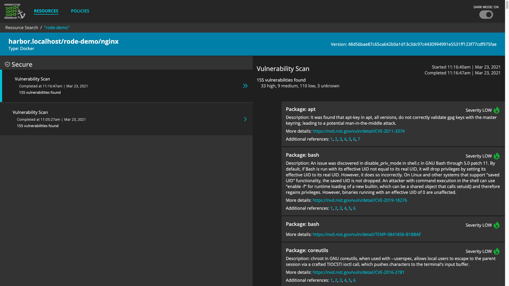

# Rode Demo - Collectors

Collectors respond to events that happen as part of the SDLC and record metadata as occurrences that can be used to verify that pre-defined requirements have been meet before software is released. 

In this demonstration we use a collector which generates metadata about image vulnerability scans run by Harbor. This metadata can then be used to ensure images meet a requirement for a maximum allowed number of security vulnerabilities.

## Generate Vulnerability Occurrences

To generate vulnerability occurrences for an image we need to push an image to the Harbor container registry. Harbor will automatically scan the image, notify the Harbor Collector that the scan was completed. The Harbor Collector in turn fetches the vulnerabilities for the image from Harbor and populates them as occurrences in Rode.

Before pushing an image, we will need to log in to Harbor using the Docker CLI:

```bash
docker login harbor.localhost -u admin -p $(kubectl get secret -n rode-demo-harbor harbor-harbor-core -o jsonpath="{.data.HARBOR_ADMIN_PASSWORD}" | base64 --decode)
```

Then, we can push an image using `docker push`. 

Push an existing image with vulnerabilities:
```bash
docker pull nginx:latest
docker tag nginx:latest harbor.localhost/rode-demo/nginx:latest
docker push harbor.localhost/rode-demo/nginx:latest
```

Verify that the image was scanned using the [Harbor UI](http://harbor.localhost)



Push an existing image with no vulnerabilities:
```bash
docker pull alpine:latest
docker tag alpine:latest harbor.localhost/rode-demo/alpine:latest
docker push harbor.localhost/rode-demo/alpine:latest
```

## Fetch Occurrences from API

Verify that the Harbor Collector created vulnerability occurrences in Rode
```
curl --location --request GET 'localhost:50052/v1alpha1/occurrences?filter="resource.uri".contains("alpine")' | jq
curl --location --request GET 'localhost:50052/v1alpha1/occurrences?filter="resource.uri".contains("nginx")' | jq
```

## View Occurrences in Rode UI

Open [Rode UI](http://rode-ui.localhost) in a web browser.

Use the _Search for a resource_ field to search for `rode_demo`.





Click the _View Resource_ button for the nginx image.

Click _Vulnerability Scan_ to view the vulnerability occurrence details.



##### next: [Policy](4-Policy.md)

---

**TODO** update story to generate occurrences using Jenkins pipeline

Inside the `/app` folder, there is a sample hello-world node app based on an Alpine image with two known medium vulnerabilities that will build on a deployed Jenkins CI server. 

Simply change the base image in the Dockerfile to `node:current-alpine3.12`, to resolve the vulnerabilities.
